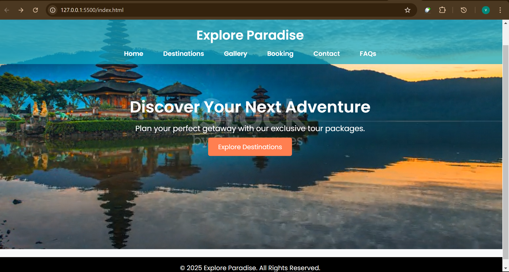
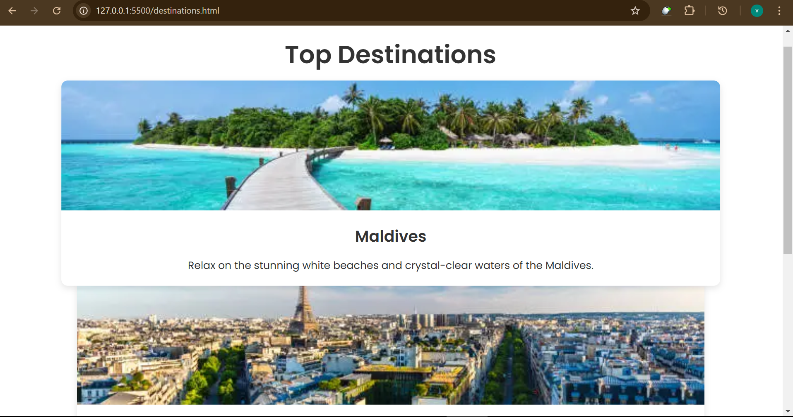
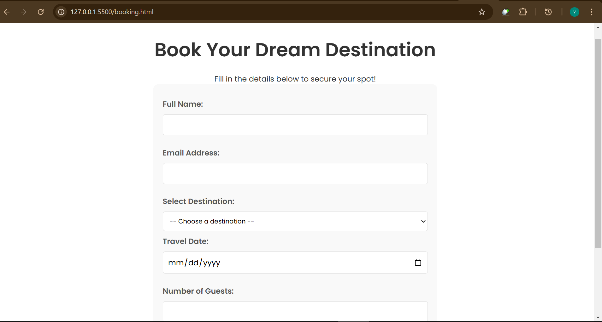
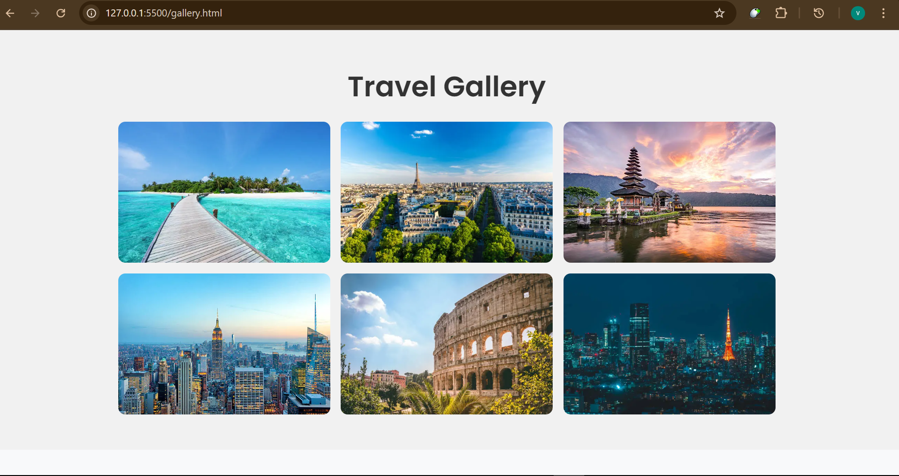
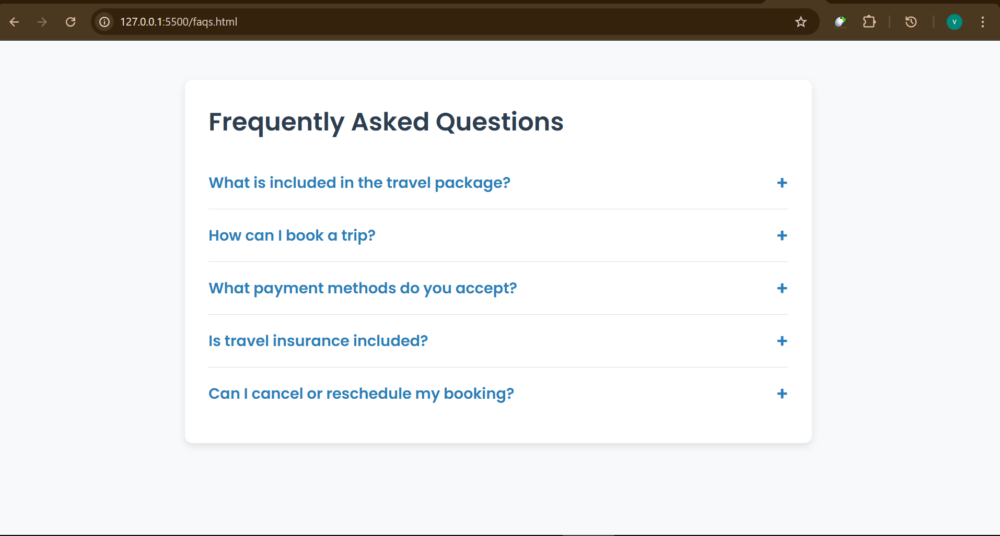

# 🌍 Explore Paradise - Travel & Tourism Website

Welcome to **Explore Paradise**, your ultimate destination for discovering breathtaking travel locations and booking your dream vacation with ease. This project is a **visually stunning, interactive, and responsive** website designed to showcase popular travel destinations and facilitate bookings.

---

## 📖 **Project Overview**
The **Explore Paradise** website is designed to provide an engaging user experience for travelers looking to explore and book exciting destinations. The site includes:
- **A captivating homepage with a video banner**
  
- **Beautiful destination showcases**
  
- **A user-friendly booking system**
  
- **An interactive travel gallery**
  
- **A contact form for inquiries**
   
- **An FAQ section for common travel-related questions**
   
---

## 🎨 **Features**
✅ **Fully Responsive Design** - Works seamlessly on all devices  
✅ **Engaging Hero Section** - Background video and call-to-action  
✅ **Booking System** - Secure and easy-to-use form  
✅ **Interactive FAQ Section** - Expandable Q&A layout  
✅ **Lightbox Gallery** - Clickable images with zoom-in feature  
✅ **Form Validation with JavaScript** - Ensures proper input handling  
✅ **Modern UI with Smooth Animations** - Clean and professional look  

---

## 🛠️ **Technologies Used**
- **HTML5** - Structure of the website  
- **CSS3** - Styling with modern UI effects  
- **JavaScript (Vanilla JS)** - Interactive features and form validation  
- **FontAwesome & Google Fonts** - Icons and typography enhancements  

---

## 🚀 **Getting Started**
### **1️⃣ Clone the Repository**
```sh
git clone https://github.com/your-username/explore-paradise.git
